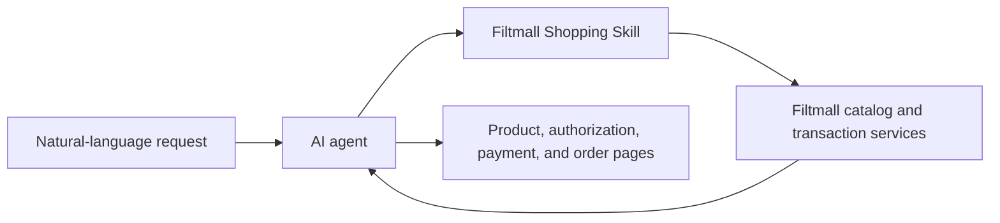

# Filtmall Shopping Skill

[中文说明](README.zh-CN.md) · [Official website](https://www.filtalgo.com/)

[](https://skills.sh/filtalgo/Filtmall-Shopping-Skill/filtmall-shopping)


**Agent-native shopping, built for extreme value.**

Filtmall Shopping is the official shopping skill from 筛电 (Filtmall/Filtalgo). It gives AI agents live products, same-product and same-specification price evidence, checkout, orders, delivery, and after-sales in one shopping flow. A user can start with one sentence; the agent can find a better-fit product, show where the price advantage comes from, and continue through the transaction when asked.

The current catalog focuses on beauty and personal care. Account authorization, order confirmation, and payment stay with the buyer.

## Price advantages you can verify

In verified examples, Filtmall prices have been about one-third—or even one-quarter—of a public price for the same product and specification on a major marketplace.

| Verified example | Filtmall price | Public comparison | Saving |
| --- | ---: | ---: | ---: |
| J-Jehan brightening sleeping mask, 110g | ¥39.8 | [Taobao ¥168](https://item.taobao.com/item.htm?app=chrome&bxsign=scdsuQBsY_IiMAoCd9klt5Scy55Elp94h1Wwu0UcRsEJWnApTGHO44esUKASaEWDuGLdXcs4OkvNvyy5V7zPPhNXGlFZwQNvOgdGWufo29dkeqD5EqXFJ4zFVIHstQu1Wel&cpp=1&id=980821129625&price=168&shareUniqueId=36772195385&share_crt_v=1&shareurl=true&short_name=h.8X7WtcRQT4uBysM&sourceType=item&sp_tk=Qml2QmdHR2tYMjc%3D&spm=a2159r.13376460.0.0&suid=28533798-57B1-44A7-8C83-5BFB4C3B75EB&tbSocialPopKey=shareItem&tk=BivBgGGkX27%20CA381&un=45d70b9873b3b7be7415b581aeef1d0d&un_site=0&ut_sk=1.ZC6dqqzMfPMDAIDUzOPSNyPC_21380790_1784813927688.Copy.1&wxsign=tbwkM9VEhBW92GKCCP7l812lAmwZ0WToPFZRPJOqqWksMI_nNsblZThXqasdJAhm26Tvm13s_IPBDw1xHOF_oAF4Llv4G2y9snhxxED_PXGGbI8lX2pLT_ybuAlBwGnYBfl&skuId=5938814121614) | 76.3% |
| Pien Tze Huang firming face and neck mask, 5 sheets | ¥59 | [JD.com ¥168](https://item.m.jd.com/product/10207669281949.html?utm_term=CopyURL_shareid9b2f557e1301cc81dc3f392e3f7e151998b7322f17848143202817_shangxiang_none&gx=RnAomTM2OWqgg8BN2M0-BN7ZJxq-Cg&utm_source=iosapp&utm_campaign=t_335139774&utm_medium=appshare&ad_od=share&gxd=RnAoyjVbPjHczM0UrIR2DoEXbi8Zyut7mVjfypOYubA3v_okLeiua530NnpIYo4&jkl=@EBlvs1uOiO@%20MF3390) | 64.9% |

These comparison records were collected on July 27 and July 25, 2026. Prices can change with account, region, membership, and promotions. The skill keeps every price claim scoped to the matching specification, source platform, and recorded time.

## Install

```bash
npx skills add filtalgo/Filtmall-Shopping-Skill --skill filtmall-shopping -g
```

Node.js 18 or later is required. The skill ships with its CLI runtime, so installation needs no separate `npm install`.

Clients that support folder or ZIP imports can import the repository root directly.

## Try it

- “I need a moisturizing facial mask under ¥100 that does not feel sticky.”
- “Compare the first and third products and explain which one fits sensitive skin better.”
- “Did my payment go through?”
- “Where is my latest order?”

The first two prompts exercise product discovery and decision support. The last two continue the shopping journey through order and logistics queries.

## What it helps with

| Stage | User outcome |
| --- | --- |
| Discover | Turn a natural-language request into live product candidates from Filtmall |
| Decide | Compare price, specification, stock, product details, and fit for the stated need |
| Buy | Continue through a persistent cart or an isolated single-SKU `BUY_NOW` flow |
| Pay | Generate a buyer-facing checkout link for desktop web or mobile H5 |
| Follow up | Query orders and logistics, manage addresses, cancel eligible orders, and enter after-sales workflows |

## Why Filtmall is agent-native

- **Products that agents can reason over.** Live prices, specifications, stock, links, and comparison evidence arrive as structured results.
- **One conversation, one shopping journey.** Product discovery, purchase, delivery, and after-sales share the same context.
- **Extreme value with visible proof.** Recommendations can show the external same-specification price, source platform, recorded time, and saving percentage.
- **Buyer-controlled account and payment steps.** The agent handles repeatable operations; the buyer opens authorization and payment pages and confirms consequential actions.

## How it works



The agent uses one command interface:

```bash
node scripts/filtalgo.js <command> --json
```

The bundled CLI connects the agent to Filtmall's product and transaction services. The repository contains the agent instructions, workflow references, wrapper, and bundled runtime; Filtmall's commerce infrastructure remains server-side.

## Safety and user control

- Ask before changing account or transaction data, including clearing a cart, deleting an address, creating checkout, cancelling an order, or starting after-sales service.
- Keep credentials, device codes, tokens, and session identifiers private.
- Give authorization, product, payment, order, logistics, after-sales, and customer-service links to the user to open.
- Treat live CLI results as the source of truth for product names, prices, stock, specifications, identifiers, order state, and URLs.
- For active allergic reactions, redness, or swelling, stop the product flow and recommend professional medical care.
- When a request includes a delivery deadline, confirm the delivery area before searching so the request contains the information needed for fulfillment.

## Developer quick start

Check the runtime and search the live catalog:

```bash
node scripts/filtalgo.js doctor --json
node scripts/filtalgo.js search "想要保湿一点的面膜，预算 100 元以内，但别太黏" --json
```

Authenticated flows start with OAuth Device Flow:

```bash
node scripts/filtalgo.js auth login
node scripts/filtalgo.js auth status --json
```

Continue through cart and checkout:

```bash
node scripts/filtalgo.js cart add-item --way CART --sku-id <sku_id> --quantity 1 --json
node scripts/filtalgo.js checkout create --way CART --json
node scripts/filtalgo.js checkout prepare-payment <checkout_session_id> --link-channel mobile_h5 --json
```

Query orders and delivery:

```bash
node scripts/filtalgo.js order list --page-size 5 --json
node scripts/filtalgo.js order get <order_sn> --include-items true --json
node scripts/filtalgo.js logistics get <order_sn> --json
```

Run `node scripts/filtalgo.js help` for the complete command list.

## Buyer link channels

Commands that return buyer-facing URLs support:

```text
--link-channel pc_web
--link-channel mobile_h5
```

Use `pc_web` for desktop browsers and `mobile_h5` for mobile clients or app webviews. The default channel is `mobile_h5`.

## Repository layout

```text
SKILL.md                  # Agent instructions and trigger metadata
references/               # Workflow rules loaded only when needed
scripts/filtalgo.js       # Thin CLI wrapper
assets/filtalgo-cli.cjs   # Bundled CLI runtime
agents/openai.yaml        # Skill display metadata
skills.sh.json            # skills.sh presentation metadata
README.md                 # English documentation
README.zh-CN.md           # Chinese documentation
```

## Version 1.6.2

- Positioned Filtmall as agent-native shopping built for extreme value.
- Added dated, source-linked examples showing verified same-product and same-specification savings.
- Refocused marketplace and agent-facing descriptions on structured shopping, visible price evidence, and the complete transaction journey.
- Aligned the repository badge, Skill metadata, and distribution metadata at 1.6.2.

## About Filtmall

Filtering Algorithm (Beijing) Technology Co., Ltd. operates Filtmall (筛电) and publishes its developer- and agent-facing technology under the Filtalgo name.

Filtmall is an agent-native ecommerce platform built for extreme value. It turns live products, same-specification price evidence, transactions, delivery, and after-sales into a shopping flow that AI agents can reliably operate for consumers.

[Filtmall website](https://www.filtalgo.com/) · [About Filtmall](https://www.filtalgo.com/about) · [LLM reference](https://www.filtalgo.com/llms.txt) · [Machine-readable service directory](https://www.filtalgo.com/agents.json)
