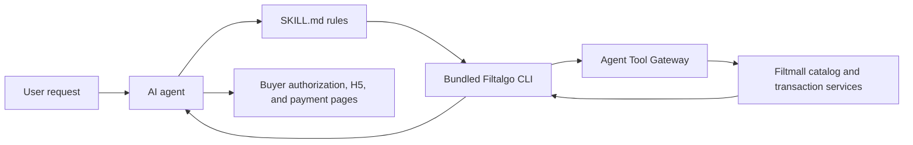

# Filtmall Shopping Skill

[中文说明](README.zh-CN.md) · [Official website](https://www.filtalgo.com/)


The official Filtmall skill for AI-assisted shopping. Users can describe what they need in natural language, compare matching products, complete checkout, and follow orders without handing account or payment control to the agent.

> Try: “I want a moisturizing facial mask, but not one that feels too sticky. Compare the available options and explain the differences.”

## Quick install

Install from the public GitHub repository with the Agent Skills CLI:

```bash
npx skills add filtalgo/Filtmall-Shopping-Skill --skill filtmall-shopping -g
```

Clients that support folder or ZIP import can use the repository root directly. The skill requires Node.js 18 or later and ships with its CLI runtime, so no separate `npm install` is needed.

## Business value

Filtmall Shopping Skill is built for value-conscious, evidence-aware shopping:

- **Natural-language demand capture:** users can express a product, budget, preference, use case, or constraint in one request.
- **Comparable choices:** the skill searches the live catalog, filters candidates, retrieves product details, and explains meaningful differences.
- **High-value supply discovery:** Filtmall continuously selects competitively priced products. Some products may reach a market-low price at the same specification and comparison time; prices and availability must always be verified from live results.
- **Transaction continuity:** the same conversation can move from discovery to cart, checkout, buyer payment, orders, logistics, refunds, and after-sales service.
- **User control:** the buyer completes authorization and payment, while the agent handles repeatable shopping steps.

The current catalog focuses on beauty and personal care. Filtmall plans to expand into more everyday consumer categories as supply and service coverage grow.

## Core capabilities

| Stage | What the skill can do |
| --- | --- |
| Discover | Search from a complete natural-language request or a shorter product, brand, or category phrase |
| Decide | Refine and rerank result sets, compare products, inspect price, stock, specifications, and product details |
| Buy | Manage a persistent cart or use an isolated single-SKU `BUY_NOW` flow |
| Pay | Prepare a buyer-facing payment URL for desktop web or mobile H5 |
| Follow up | Query orders and logistics, manage addresses, cancel eligible orders, and start refund or after-sales workflows |
| Get help | Open the appropriate buyer-facing customer-service page |

## How it works



The agent invokes:

```bash
node scripts/filtalgo.js <command> --json
```

The bundled CLI calls the Filtalgo protocol adapter’s Agent Tool Gateway. It does not call service, UCP, or ACP endpoints directly.

### Search pipeline

The default `search` command handles the full natural-language request. It discovers the appropriate catalog adapter, loads the category context, starts a structured search, summarizes the result set, and hydrates product data. The agent can then refine or rerank the same result set instead of restarting the search.

### Cart and direct purchase

The two purchase paths are deliberately isolated:

- `CART` is the persistent shopping-cart flow.
- `BUY_NOW` is a temporary, single-SKU flow used only after the buyer confirms a specific SKU and quantity.

This separation prevents an immediate purchase from overwriting or mixing with the user’s normal cart.

### Authentication

Login uses OAuth Device Flow. The CLI stores only an opaque `agent_session_id`; it does not store OAuth access or refresh tokens. Search can run anonymously, while cart, checkout, orders, addresses, customer service, and after-sales operations require a valid session.

## Quick start

Check the runtime and start a search:

```bash
node scripts/filtalgo.js auth login
node scripts/filtalgo.js doctor --json
node scripts/filtalgo.js search "想要保湿一点的面膜，但别太黏" --json
```

Use the normal cart flow:

```bash
node scripts/filtalgo.js cart add-item --way CART --sku-id <sku_id> --quantity 1 --json
node scripts/filtalgo.js checkout create --way CART --json
node scripts/filtalgo.js checkout prepare-payment <checkout_session_id> --json
```

Or use the isolated direct-purchase flow after the buyer confirms one SKU:

```bash
node scripts/filtalgo.js buy-now <sku_id> --quantity 1 --json
node scripts/filtalgo.js checkout prepare-payment <checkout_session_id> --json
```

After payment, query the order and delivery state:

```bash
node scripts/filtalgo.js order list --page-size 5 --json
node scripts/filtalgo.js order get <order_sn> --include-items true --json
node scripts/filtalgo.js logistics get <order_sn> --json
```

Run `node scripts/filtalgo.js help` for the full command list.

## Buyer links

Commands that return buyer-facing links support:

```text
--link-channel pc_web
--link-channel mobile_h5
```

Use `pc_web` for desktop browsers and `mobile_h5` for mobile clients or app webviews. When the option is omitted, the CLI defaults to `mobile_h5`.

## Safety and operating boundaries

- Ask the user before changing account or transaction data, including clearing a cart, deleting an address, creating checkout, cancelling an order, or starting after-sales service.
- Never display credentials, session identifiers, device codes, access tokens, or refresh tokens.
- Show authorization, product, payment, order, logistics, after-sales, and customer-service links to the user; do not open them automatically.
- Treat product names, prices, stock, specifications, SKU IDs, order numbers, and URLs from the CLI as the source of truth.
- Do not recommend cosmetics as a response to active allergic reactions, redness, or swelling. Advise the user to seek professional medical care.
- Price and stock can change. A “market-low” comparison applies only to the same specification and the recorded comparison time.

## Repository layout

```text
SKILL.md                  # Agent instructions and operating rules
README.md                 # English project documentation
README.zh-CN.md           # Chinese project documentation
scripts/filtalgo.js       # Thin CLI wrapper
assets/filtalgo-cli.cjs   # Bundled CLI runtime
agents/openai.yaml        # Skill display metadata
```

## Version 1.3.0

- Expanded natural-language search into a structured discovery, context, summary, hydration, refine, and rerank pipeline.
- Added product lookup and detail commands.
- Separated persistent `CART` and temporary `BUY_NOW` flows.
- Added desktop web and mobile H5 buyer-link selection.
- Restored HTTPS certificate verification in the bundled runtime.
- Updated examples, safety rules, and public documentation.

## About Filtalgo

[Filtalgo](https://www.filtalgo.com/) develops AI-assisted commerce infrastructure for product discovery, comparable supply, transaction execution, and post-purchase service. Filtmall Shopping Skill is its official shopping skill.
