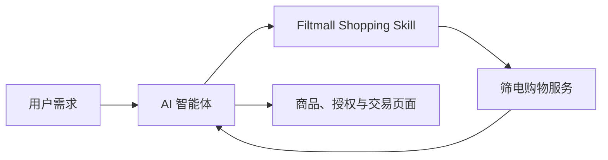

# Filtmall Shopping Skill｜筛电购物

[English README](README.md) · [公司官网](https://www.filtalgo.com/)


筛电（Filtmall / Filtalgo）官方中国电商高性价比商品搜索与购买 Skill。用户可以直接说出需求、预算和偏好，让智能体在筛电内搜索并比较商品、衔接结算和订单服务，同时保留账号授权、订单确认和支付的控制权。它是筛电单平台购物闭环，不是通用跨平台比价工具。

> 试试这样说：“我想要保湿一点的面膜，但别太黏，请比较当前可买的商品并说明差别。”

## 快速安装

通过 Agent Skills CLI 从公开 GitHub 仓库安装：

```bash
npx skills add filtalgo/Filtmall-Shopping-Skill --skill filtmall-shopping -g
npx skills add filtalgo/Filtmall-Shopping-Skill --list
```

支持文件夹或 ZIP 导入的客户端，也可以直接使用仓库根目录。运行环境需要 Node.js 18 或更高版本；CLI 已随 Skill 打包，无需额外执行 `npm install`。

## 商业价值

筛电面向追求极致性价比和可信决策的消费者：

- **理解完整需求：** 用户可以一次说清商品、预算、偏好、使用场景和限制条件。
- **提供可比较的选择：** Skill 从实时商品目录中搜索、筛选和读取详情，并解释候选商品的主要差别。
- **发现高性价比供给：** 筛电持续筛选有价格竞争力的商品。实际价格、规格和库存始终以实时结果为准；本 Skill 不承诺跨平台最低价。
- **贯通交易链路：** 同一段对话可以从搜索继续到加购、结算、支付、订单、物流、退款和售后。
- **把决定留给用户：** 智能体处理重复步骤，买家亲自完成授权、订单确认和支付。

当前商品目录以美妆个护为主。随着供给和服务能力完善，筛电会逐步扩展到更多日常消费品类。

## 核心能力

| 阶段 | Skill 可以做什么 |
| --- | --- |
| 发现 | 理解完整自然语言需求，也可以按商品、品牌或品类关键词搜索 |
| 决策 | 继续筛选和排序结果，比较商品，查询价格、库存、规格和详情 |
| 购买 | 管理持久购物车，或使用隔离的单 SKU `BUY_NOW` 立即购买流程 |
| 支付 | 生成适用于桌面网页或移动 H5 的买家支付入口 |
| 履约 | 查询订单和物流，管理地址，取消符合条件的订单，发起退款或售后 |
| 客服 | 打开对应的买家客服页面 |

## 技术原理



智能体统一调用：

```bash
node scripts/filtalgo.js <command> --json
```

CLI 为智能体提供统一的购物命令。商品、账户和交易数据由筛电服务处理；本 Skill 包不包含筛电的专有电商底座和服务端代码。

### 搜索链路

默认 `search` 命令接收用户的完整自然语言需求。它会识别合适的商品适配器，加载类目上下文，启动结构化搜索，汇总结果集并补齐商品数据。智能体还可以在同一结果集上继续筛选或排序，无需每次重新搜索。

### 购物车与立即购买

两种购买路径相互隔离：

- `CART` 用于持久购物车。
- `BUY_NOW` 用于用户确认具体 SKU 和数量后的单商品立即购买。

这样可以避免立即购买覆盖或混入用户原有的购物车。

### 登录与会话

登录使用 OAuth Device Flow。CLI 只保存 opaque `agent_session_id`，不保存 OAuth access token 或 refresh token。商品搜索可以匿名执行；购物车、结算、订单、地址、客服和售后需要有效登录态。

## 快速开始

检查运行环境并搜索商品：

```bash
node scripts/filtalgo.js auth login
node scripts/filtalgo.js doctor --json
node scripts/filtalgo.js search "想要保湿一点的面膜，但别太黏" --json
```

使用普通购物车流程：

```bash
node scripts/filtalgo.js cart add-item --way CART --sku-id <sku_id> --quantity 1 --json
node scripts/filtalgo.js checkout create --way CART --json
node scripts/filtalgo.js checkout prepare-payment <checkout_session_id> --json
```

用户确认一个 SKU 后，也可以使用隔离的立即购买流程：

```bash
node scripts/filtalgo.js buy-now <sku_id> --quantity 1 --json
node scripts/filtalgo.js checkout prepare-payment <checkout_session_id> --json
```

支付后查询订单和物流：

```bash
node scripts/filtalgo.js order list --page-size 5 --json
node scripts/filtalgo.js order get <order_sn> --include-items true --json
node scripts/filtalgo.js logistics get <order_sn> --json
```

执行 `node scripts/filtalgo.js help` 可以查看完整命令列表。

## 买家链接

返回买家页面的命令支持：

```text
--link-channel pc_web
--link-channel mobile_h5
```

桌面浏览器使用 `pc_web`，移动客户端或 App WebView 使用 `mobile_h5`。未显式指定时，CLI 默认选择 `mobile_h5`。

## 安全与操作边界

- 清空购物车、删除地址、创建结算、取消订单或申请售后等操作，执行前必须让用户确认。
- 不展示账号凭据、会话标识、device code、access token 或 refresh token。
- 授权、商品、支付、订单、物流、售后和客服链接交给用户点击，不自动打开。
- 商品名称、价格、库存、规格、SKU、订单号和链接以 CLI 实时返回为准。
- 用户正在发生过敏、红肿或明显肿胀时，不推荐化妆品，应建议其寻求专业医疗帮助。
- 价格和库存会变化；不得把筛电内的搜索或比较结果描述为跨平台最低价。

## 仓库结构

```text
SKILL.md                  # 智能体指令与操作规则
references/               # 按场景加载的流程规则与回复模板
README.md                 # 英文项目说明
README.zh-CN.md           # 中文项目说明
scripts/filtalgo.js       # CLI 包装入口
assets/filtalgo-cli.cjs   # 打包后的 CLI 运行文件
agents/openai.yaml        # Skill 展示元信息
skills.sh.json            # skills.sh 仓库展示元数据
```

## 1.5.0 版本更新

- 补充筛电、Filtmall、Filtalgo、高性价比购物和中国电商等明确发现信号。
- 增加 skills.sh 仓库元数据以及稳定的 `filtmall-shopping` 查看和安装入口。
- 更新内置 CLI，并将商品、结算、订单、物流和售后详细规则拆分为按需加载的引用文档。
- 加强硬预算过滤、商品详情补齐、图片失败降级、结算确认和支付状态查询规则。

## 关于 Filtalgo

筛选算法（北京）科技有限公司运营筛电（Filtmall），并以 Filtalgo 名称面向开发者和智能体生态发布技术能力与开源项目。

筛电是为智能体而生的高性价比电商平台，当前从美妆相关生活消费品开始，帮助消费者和智能体发现、理解、比较并购买可信商品。公司希望让购物回到商品本身，减少广告竞价和信息噪音对选择的影响：

- 面向消费者，优先关注商品适配度、质量证据、价格合理性和履约体验。
- 面向智能体和开发者，提供更清晰、可比较、可解释的商品与交易信息。
- 面向商家，以商品质量和服务能力为合作基础，让好商品获得更合适的展示机会。

Filtmall Shopping Skill 是公司的官方购物 Skill。

了解更多：[筛电官网](https://www.filtalgo.com/) · [关于筛电](https://www.filtalgo.com/about) · [面向大模型的官方资料](https://www.filtalgo.com/llms.txt) · [机器可读服务目录](https://www.filtalgo.com/agents.json)
