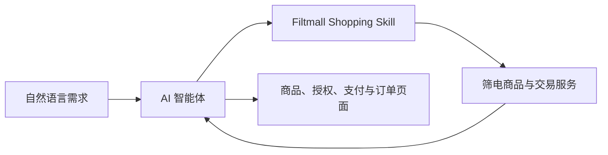

# Filtmall Shopping Skill｜筛电购物

[English README](README.md) · [筛电官网](https://www.filtalgo.com/)

[](https://skills.sh/filtalgo/Filtmall-Shopping-Skill/filtmall-shopping)


在一段智能体对话里，完成筛电商品的搜索、比较、购买和订单跟进。

Filtmall Shopping 是筛电（Filtmall / Filtalgo）官方购物 Skill。用户直接说出想买什么、预算多少、在意哪些体验或限制条件，Skill 会搜索筛电实时商品目录，解释合适候选之间的差别，并按需继续处理结算、订单、物流和售后。

当前商品目录以美妆个护为主。账号授权、订单确认和支付由买家本人完成。

## 安装

```bash
npx skills add filtalgo/Filtmall-Shopping-Skill --skill filtmall-shopping -g
```

运行环境需要 Node.js 18 或更高版本。CLI 已随 Skill 打包，无需另外执行 `npm install`。

支持文件夹或 ZIP 导入的客户端可以直接导入仓库根目录。

## 试试这样说

- “想买一款 100 元以内、保湿但别太黏的面膜。”
- “比较第 1 款和第 3 款，敏感肌更适合哪一款？”
- “我付完了吗？”
- “我最近一笔订单到哪里了？”

前两条用于商品发现和购买决策，后两条会继续查询订单与物流状态。

## 它能帮用户完成什么

| 阶段 | 用户得到的结果 |
| --- | --- |
| 发现 | 把自然语言需求转成筛电实时商品候选 |
| 决策 | 比较价格、规格、库存、商品详情和需求适配度 |
| 购买 | 继续使用持久购物车，或进入隔离的单 SKU `BUY_NOW` 流程 |
| 支付 | 生成适用于桌面网页或移动 H5 的买家结算入口 |
| 跟进 | 查询订单和物流，管理地址，取消符合条件的订单，进入售后流程 |

## 为什么使用这个 Skill

- **一段对话贯通购物流程。** 商品发现、购买、履约和售后共享同一段需求上下文。
- **实时、可比较的商品信息。** 推荐来自当前商品目录，并解释与用户需求直接相关的差别。
- **账号与支付由买家控制。** 智能体处理重复步骤，买家打开授权和支付页面，并确认会影响账号或交易的操作。
- **证据边界清楚。** 价格、库存、规格和可售状态以实时结果为准；价格比较限定在同规格和记录的比价时点。

## 工作方式



智能体通过同一个命令入口工作：

```bash
node scripts/filtalgo.js <command> --json
```

内置 CLI 连接筛电的商品和交易服务。仓库包含智能体指令、流程参考、包装入口和打包运行文件；筛电电商基础设施运行在服务端。

## 安全与用户控制

- 清空购物车、删除地址、创建结算、取消订单或申请售后前，先让用户确认。
- 保护账号凭据、设备码、令牌和会话标识。
- 授权、商品、支付、订单、物流、售后和客服链接交给用户打开。
- 商品名称、价格、库存、规格、标识、订单状态和链接以实时返回结果为准。
- 用户正在发生过敏、红肿或明显肿胀时，停止商品流程并建议寻求专业医疗帮助。
- 用户要求在指定日期前送达时，搜索前先确认收货地区，让履约条件完整。

## 开发者快速开始

检查运行环境并搜索实时商品目录：

```bash
node scripts/filtalgo.js doctor --json
node scripts/filtalgo.js search "想要保湿一点的面膜，预算 100 元以内，但别太黏" --json
```

需要账号的流程从 OAuth Device Flow 开始：

```bash
node scripts/filtalgo.js auth login
node scripts/filtalgo.js auth status --json
```

继续处理购物车和结算：

```bash
node scripts/filtalgo.js cart add-item --way CART --sku-id <sku_id> --quantity 1 --json
node scripts/filtalgo.js checkout create --way CART --json
node scripts/filtalgo.js checkout prepare-payment <checkout_session_id> --link-channel mobile_h5 --json
```

查询订单和物流：

```bash
node scripts/filtalgo.js order list --page-size 5 --json
node scripts/filtalgo.js order get <order_sn> --include-items true --json
node scripts/filtalgo.js logistics get <order_sn> --json
```

执行 `node scripts/filtalgo.js help` 可以查看完整命令列表。

## 买家链接渠道

返回买家页面的命令支持：

```text
--link-channel pc_web
--link-channel mobile_h5
```

桌面浏览器使用 `pc_web`，移动客户端或 App WebView 使用 `mobile_h5`。默认渠道是 `mobile_h5`。

## 仓库结构

```text
SKILL.md                  # 智能体指令与触发元数据
references/               # 按需加载的流程规则
scripts/filtalgo.js       # CLI 包装入口
assets/filtalgo-cli.cjs   # 打包后的 CLI 运行文件
agents/openai.yaml        # Skill 展示元数据
skills.sh.json            # skills.sh 展示元数据
README.md                 # 英文说明
README.zh-CN.md           # 中文说明
```

## 1.6.1 版本更新

- 重写 README 的信息顺序，让读者更快看到价值、安装方式、使用示例、能力和信任边界。
- 压缩分发平台与智能体可见描述，保留购物、支付状态、送达日期和医疗安全等关键触发场景。
- 将冗长的界面默认提示改成一句可直接使用的示例。
- 统一仓库徽章、版本章节、Skill 元数据和分发元数据为 1.6.1。

## 关于筛电

筛选算法（北京）科技有限公司运营筛电（Filtmall），并以 Filtalgo 名称发布面向开发者和智能体生态的技术能力。

筛电是面向 AI 智能体的高性价比电商平台，帮助消费者通过更清晰的商品与交易信息发现、理解、比较和购买商品。

[筛电官网](https://www.filtalgo.com/) · [关于筛电](https://www.filtalgo.com/about) · [面向大模型的官方资料](https://www.filtalgo.com/llms.txt) · [机器可读服务目录](https://www.filtalgo.com/agents.json)
